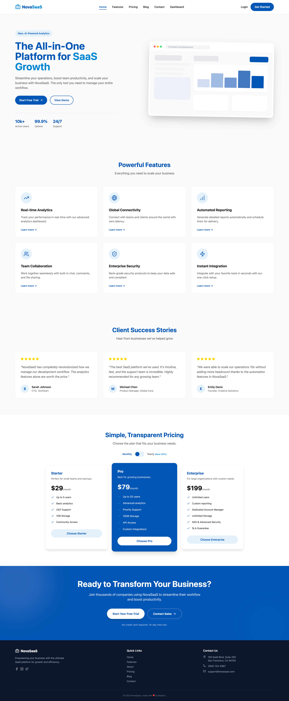

# NovaSaas - React Tailwind SaaS Template



**NovaSaas** is a free, open-source SaaS template. It features a modern design and essential pages for launching your software product. Built with **React** and **Tailwind CSS**, it's the perfect **free SaaS template** for **startups** and **tech companies**.

---

## Features

-   **SaaS Focused:** Designed for software products.
-   **Dashboard Preview:** Glimpse of the admin area.
-   **Scalable:** Built to grow with your product.

## 🚀 Quick Start

1.  **Clone the repository**
    ```bash
    git clone <repository-url>
    cd novasaas-lite
    ```

2.  **Install dependencies**
    ```bash
    npm install
    ```

3.  **Start development server**
    ```bash
    npm run dev
    ```

## 💎 Upgrade to Pro

Scale your SaaS with NovaSaas Pro:

-   **Full Dashboard:** Analytics, Team Management, Settings, Billing.
-   **Complete Auth:** Login, Signup, Password Reset.
-   **Marketing Pages:** Blog, Contact, About, Careers.

[**Get NovaSaas Pro**](https://reative.org/product/nova-saas)

## License

&copy; 2025 Reative. This project is licensed under the MIT License.
